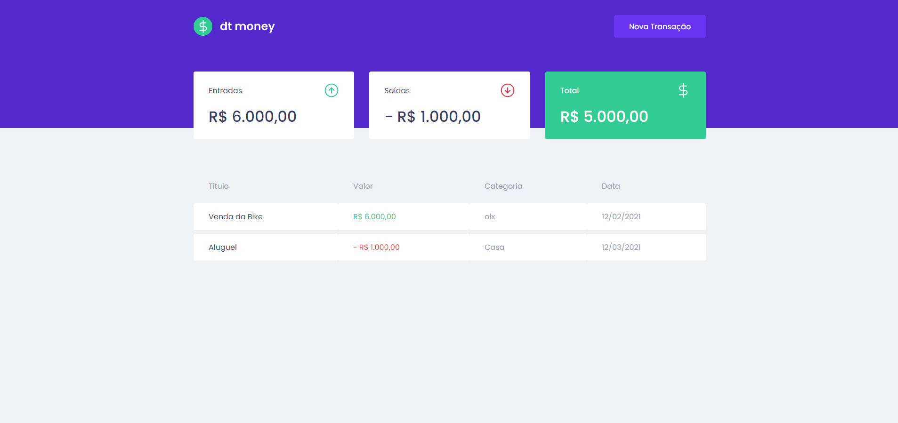

<h1 align="center">
    
    <br>
</h1>
<h4 align="center">
  App para gerenciamento dos seus gastos. 
</h4>

<p align="center">
  <a href="#rocket-technologies">Technologies</a>&nbsp;&nbsp;&nbsp;|&nbsp;&nbsp;&nbsp;
  <a href="#information_source-how-to-use">How To Use</a>&nbsp;&nbsp;&nbsp;|&nbsp;&nbsp;&nbsp;
</p>

<p align="center">
  
</p>

## :rocket: Technologies

This project was developed with the following technologies:

- [React](https://reactjs.org/)
- [Typescript](https://www.typescriptlang.org/)
- [Styled-components](https://styled-components.com/)
- [MirageJs](https://miragejs.com/)

## :information_source: How To Use

To clone and run this application, you'll need [Git](https://git-scm.com), [Node.js v10.16][nodejs]. From your command line:

```bash
# Clone this repository
$ git clone https://github.com/igor-marchi/dtMoney.git dtMoney
# Go into the repository
$ cd dtMoney
# Install dependencies
$ npm install or yarn
```
